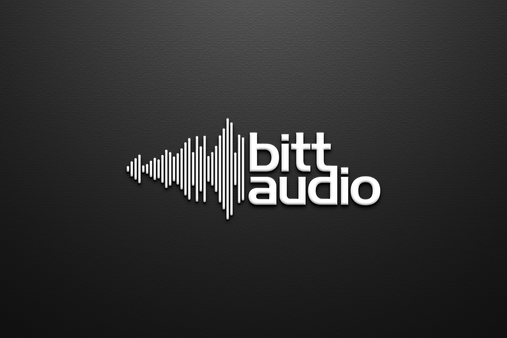

# BittAudio (SN 50) | Audio Generation Subnet on Bittensor

The main goal of the BittAudio is to establish a decentralized platform that incentivizes the creation, distribution and also monetization of AI audio content, such as:
- Text-to-Music (TTM) <br>

Validators and miners work together to ensure high-quality outputs, fostering innovation and rewarding contributions in the audio domain.<br>
By introducing audio generation service such as Text-to-Music, this subnetwork expands the range of available service within the Bittensor ecosystem. This diversification enhances the utility and appeal of the Bittensor platform to a broader audience, including creators, influencers, developers, and end-users interested in audio content.<br><br>

## Validators & Miners Interaction
- Validators initiate requests filled with the required data and encrypt them with a symmetric key. 
- Requests are signed with the validator’s private key to certify authenticity. 
- Miners decrypt the requests, verify the signatures to ensure authenticity, process the requests, and then send back the results, encrypted and signed for security.

**Validators** are responsible for initiating the generation process by providing prompts to the Miners on the network. These prompts serve as the input for TTM service. The Validators then evaluate the quality of the generated audio and reward the Miners based on the output quality.<br>
Please refer to the [Validator Documentation](docs/validator.md)

**Miners** in the Audio Subnetwork are tasked with generating audio from the text prompts received from the Validators. Leveraging advanced TTM models, miners aim to produce high-fidelity music melodies. The quality of the generated audio is crucial, as it directly influences the miners' rewards.<br>
Please refer to the [Miner Documentation](docs/miner.md)

## Workflow

1. **Prompt Generation:** The Validators generates TTM prompts and distributes them to the Miners on the network.

2. **Audio Processing:** Miners receive the prompts and utilize TTM models to convert the text into audio (music).

3. **Quality Evaluation:** The Validator assesses the quality of the generated audio, considering factors such as: clarity, naturalness, and adherence to the prompt.

4. **Reward Distribution:** Based on the quality assessment, the Validator rewards Miners accordingly. Miners with consistently higher-quality outputs receive a larger share of rewards.

## Benefits

- **Decentralized Text-to-Audio:** The subnetwork decentralizes the Text-to-Music process, distributing the workload among participating Miners.
  
- **Quality Incentives:** The incentive mechanism encourages Miners to continually improve the quality of their generated audio.

- **Bittensor Network Integration:** Leveraging the Bittensor network ensures secure and transparent interactions between Validators and Miners.

Join BittAudio and contribute to the advancement of decentralized Text-to-Music technology within the Bittensor ecosystem.

## SOTA Benchmarking for Audio Evaluation

To ensure the quality of audio generated by miners, we use a SOTA (State-of-the-Art) benchmarking process. Validators download sound files from the following link:  
https://huggingface.co/datasets/etechgrid/ttm-validation-dataset

The output generated by miners is evaluated using three different metrics:

1. **Kullback-Leibler Divergence (KLD):** Measures the divergence between two probability distributions, allowing us to assess the distribution similarity between generated music and the original distribution of audio data.
   
2. **Frechet Audio Distance (FAD):** Calculates the difference between the statistical distribution of generated audio and real-world audio. This metric provides a robust evaluation of the overall quality, including the structure and timbre of generated music.

3. **CLAP Metric:** Evaluates text consistency by determining how well the generated audio adheres to the original text prompt. It measures the semantic alignment between the input text and the generated output.

These metrics provide a comprehensive evaluation of the audio quality, and this new system is more robust compared to the previous metrics, which were a combination of CLAP, SNR (Signal-to-Noise Ratio), and HNR (Harmonic-to-Noise Ratio).

### Benchmark Milestone:
| Model                    | Frechet Audio Distance | KLD  | Text Consistency | Chroma Cosine Similarity |
|--------------------------|------------------------|------|------------------|--------------------------|
| facebook/musicgen-small   | 4.88                   | 1.42 | 0.27             | -                        |
| facebook/musicgen-medium  | 5.14                   | 1.38 | 0.28             | -                        |
| facebook/musicgen-large   | 5.48                   | 1.37 | 0.28             | -                        |
| facebook/musicgen-melody  | 4.93                   | 1.41 | 0.27             | 0.44                     |

For more information on these models, you can visit:  
https://huggingface.co/facebook/musicgen-small

## Installation
```bash 
git clone https://github.com/UncleTensor/BittAudio.git
cd BittAudio
pip install -e .
pip install -r requirements.txt
wandb login
```

## Recommended GPU Configuration

It is recommended to use NVIDIA GeForce RTX A6000 GPUs at minimum for both Validators and Miners.


**Evaluation Mechanism:** <br>
The evaluation mechanism involves the Validators querying miners on the network with random prompts and receiving TTM responses. These responses are scored based on correctness, and the weights on the Bittensor network are updated accordingly. The scoring is conducted using a reward function from the lib module.

**Miner/Validator Hardware Specs:**<br>
The hardware requirements for miners and validators vary depending on the complexity and resource demands of the selected TTM models. Typically, a machine equipped with a capable CPU and GPU, along with sufficient VRAM and RAM, is necessary. The amount of disk space required will depend on the size of the models and any additional data.

**How to Run a Validator:**<br>
To operate a validator, you need to run the validator.py script with the required command-line arguments. This script initiates the setup of Bittensor objects, establishes a connection to the network, queries miners, scores their responses, and updates weights accordingly.

**How to Run a Miner:**<br>
To operate a miner, run the miner.py script with the necessary configuration. This process involves initializing Bittensor objects, establishing a connection to the network, and processing incoming TTM requests.

**TTM Models Supported:**<br>
The code incorporates various Text-to-Music models. The specific requirements for each model, including CPU, GPU VRAM, RAM, and disk space, are not explicitly stated in the provided code. For these type of requirements, it may be necessary to consult the documentation or delve into the implementation details of these models.

In general, the resource demands of TTM models can vary significantly. Larger models often necessitate more powerful GPUs and additional system resources. It is advisable to consult the documentation or model repository for the specific requirements of each model. Additionally, if GPU acceleration is employed, having a compatible GPU with enough VRAM is typically advantageous for faster processing.

## License
This repository is licensed under the MIT License.

```text
MIT License

Copyright (c) 2024 Opentensor

Permission is hereby granted, free of charge, to any person obtaining a copy
of this software and associated documentation files (the "Software"), to deal
in the Software without restriction, including without limitation the rights
to use, copy, modify, merge, publish, distribute, sublicense, and/or sell
copies of the Software, and to permit persons to whom the Software is
furnished to do so, subject to the following conditions:

The above copyright notice and this permission notice shall be included in all
copies or substantial portions of the Software.

THE SOFTWARE IS PROVIDED "AS IS", WITHOUT WARRANTY OF ANY KIND, EXPRESS OR
IMPLIED, INCLUDING BUT NOT LIMITED TO THE WARRANTIES OF MERCHANTABILITY,
FITNESS FOR A PARTICULAR PURPOSE AND NONINFRINGEMENT. IN NO EVENT SHALL THE
AUTHORS OR COPYRIGHT HOLDERS BE LIABLE FOR ANY CLAIM, DAMAGES OR OTHER
LIABILITY, WHETHER IN AN ACTION OF CONTRACT, TORT OR OTHERWISE, ARISING FROM,
OUT OF OR IN CONNECTION WITH THE SOFTWARE OR THE USE OR OTHER DEALINGS IN THE
SOFTWARE.

```
